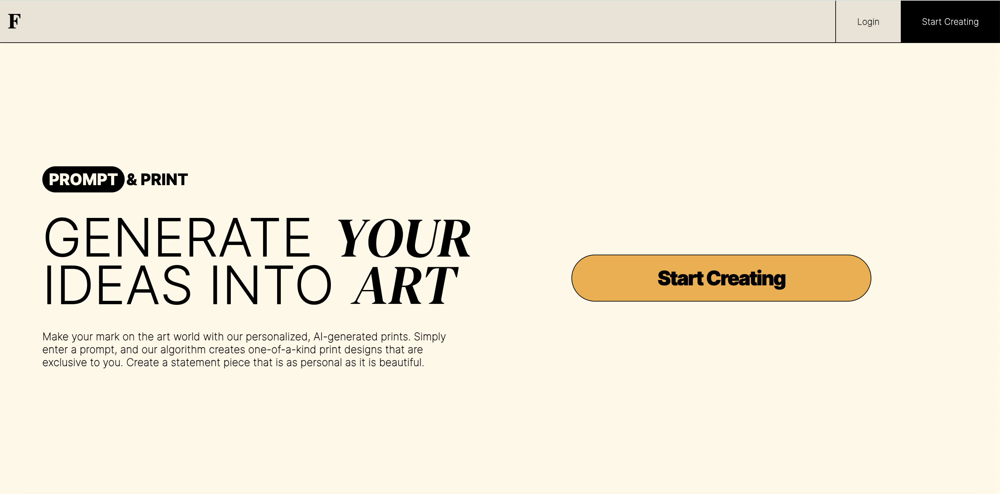
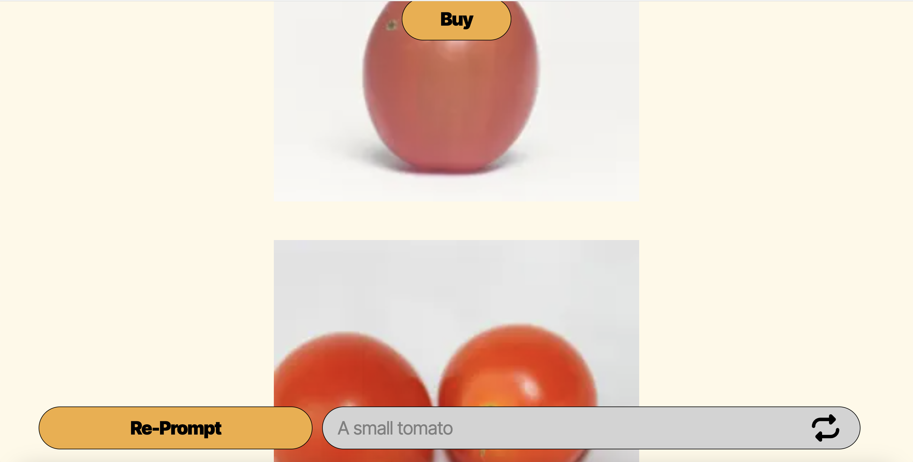
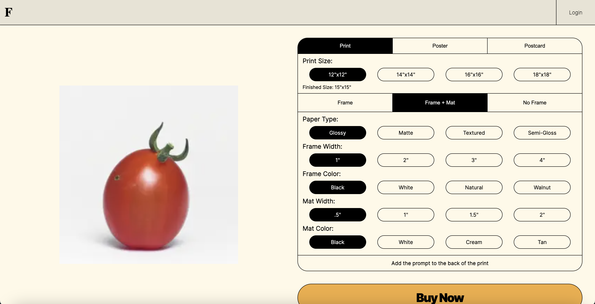
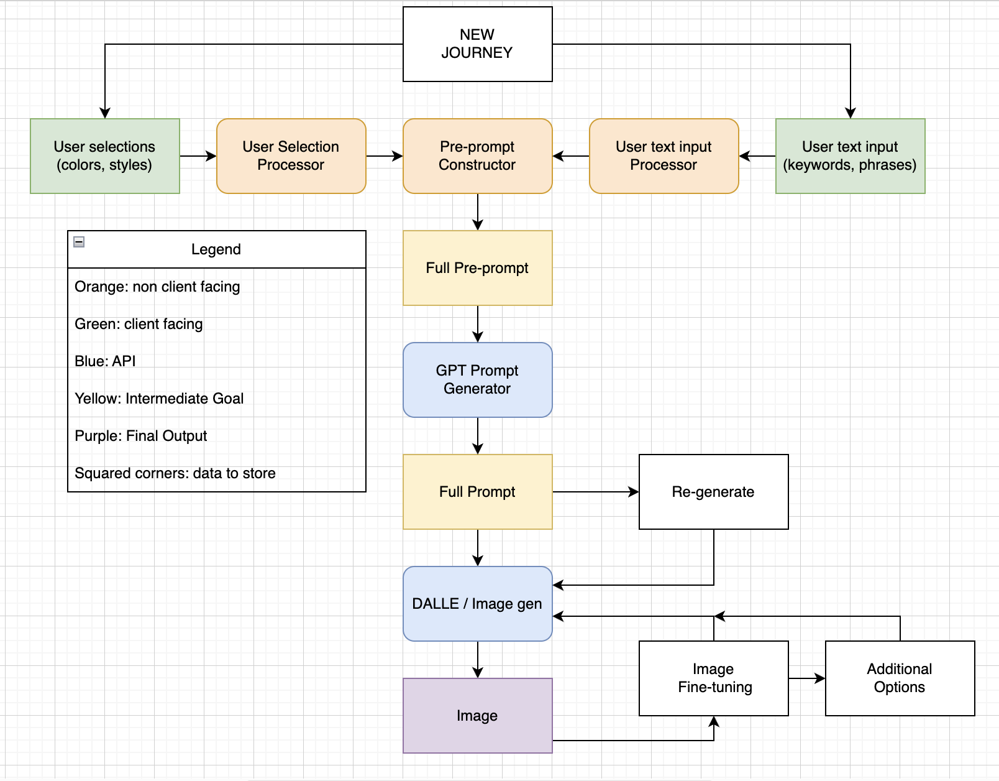
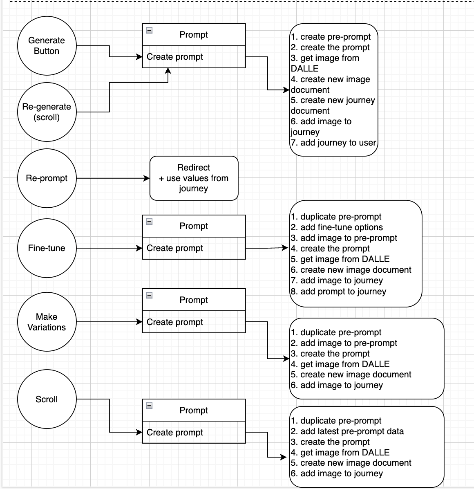
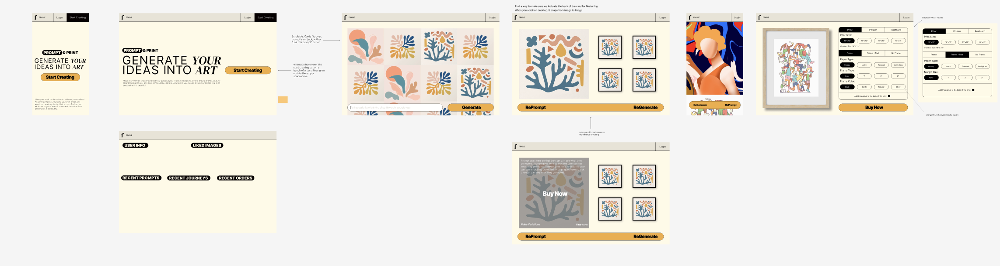
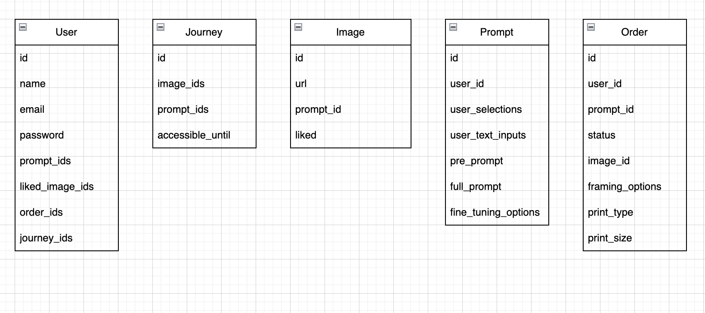

[![Contributors][contributors-shield]][contributors-url]

<h1 style="text-align:center; font-size: xxx-large">FRAiME</h1>

  

    This project is an in-progress AI-powered eCommerce site, leveraging the power of generative AI to allow users to create bespoke art and order prints of the art that they've created.
     
    <a href="https://www.fraimed.art"><strong>View the live site »</strong></a>
     
    <a href="https://github.com/ColinSprows/fraime"><strong>Explore the repo »</strong></a>
     
  

  
Table of Contents

  <ol>
    <li><a href="#built-with">Built With</a></li>
    <li> <a href="#about-the-project">About The Project</a></li>
    <li><a href="#walkthrough">Walkthrough</a></li>
    <li><a href="#roadmap">Roadmap</a></li>
    <li><a href="#development">Development</a></li>
    <li><a href="#installation-and-usage">Installation and Usage</a></li>
    <li><a href="#contributing">Contributing</a></li>
    <li><a href="#license">License</a></li>
    <li><a href="#contact">Contact</a></li>
    <li><a href="#acknowledgments">Acknowledgments</a></li>

  </ol>

## Built With

  

    

      
    

    

      
    

    

      
    

    

      
    

    

      
    

    

      
    

    

      
    

  

  

  

      
    

    

      
    

    

      
    

    

      
    

    

      
    

    

      
    

   

   
   

## About the Project

FRAiME is an eCommerce platform still in development, leveraging OpenAI’s DALL-E API to allow users to generate bespoke art and order high-quality prints. It currently features a full journey for a guest user, with text-to-image fully working, allowing a user to enter a prompt, see the generated options, and select one for purchase. A purchase page, powered by Stripe, allows the user to 'purchase' the print (using Stripe's test credit card info).

An extensive set of future development is in the works, with this acting as proof-of-concept MVP. Please see [Roadmap](#roadmap) for more details.

## Walkthrough

The journey starts on the Generate page, where the user can type in their own prompt to generate an image or see suggestions/inspiration of other pre-generated prompts.
  

The user is then taken to the Discover page, where FRAiME generates several images (two for now) based on the user's prompt. They have option to re-roll with their existing prompt, to go back to Generate and start over, or to select a print to purchase, which will take them to the Product page.
  

Once the user clicks Buy, they are brought to the Product page, where they can select from a wide range of purchase options. From a framed print to a postcard, there are many possibilities. Once the user has selected their desired options, they can choose to Buy Now, which will take them to the checkout page, powered by Stripe.
  

## Roadmap

We have an extensive plan for future development, centered on better leveraging the power of generative AI to keep the user experience engaging and accessbile and the product offered exceptional. Some of the features we are planning include:

- Selectable options that act as preprompts for the generative AI
- A call to DaVinci to interpret the user's inputs and the preprompts and create refined prompts for DALL-E
- Finetuning options on the Discovery page, to allow the user to refine their creation
- User accounts and authentication, to store past searches and allow for secure checkout
- Direct print ordering
- A fully functional purchase page with real credit card processing

## Development

Our collaborative team implemented agile methodologies in an extended planning phase, to try and enable clear opportunities for sprints and alleviate tech debt concerns as the project developed. We created a full front-end wireframe and back-end schema for the database, CRUD routes, and the overall interactions between front-end, back-end, and external API that we imagined. Below are some screenshots of our planning documents.

  

    
    
Macro Overview of full site capabilities

  

  

    
    
Full Image generation journey, overview

  

 

    
    
Front-end and back-end handshake

  

  

    
    
Front-end and back-end handshake, cont.

  

  

    
    
Full Figma Stylesheet

  

  

    
    
Figma UI wireframe

  
    
Original DB Models

  

  

## Installation and Usage

To install, clone the repo and run `npm install` in the root directory. You will need to create a `.env` file in the root directory, with the following variables, some of which will require you to get your own API keys:

- `NEXT_PUBLIC_DALL_E_API_KEY` - your DALL-E API key
- `NEXT_PUBLIC_STRIPE_PUBLISHABLE_KEY` - your Stripe publishable key
- `STRIPE_SECRET_KEY` - your Stripe secret key
- `MONGODB_URI` - your MongoDB URI

For further clarification, follow the .env.example.

After successfully getting setup, you can run `npm run dev` to start the development server.

## Contributing

If you'd like to contribute, please fork the repository and use a feature branch. Pull requests are welcome!

## License

Distributed under the MIT License. See `LICENSE` for more information.

## Contact

Elias Spector-Zabusky:

- [LinkedIn](https://www.linkedin.com/in/elias-sz/)
- [Portfolio](http://www.EliasSZ.com/)
- [Github](https://www.github.com/ColdWeatherBoyy)
- [Email](mailto:elias.spector.zabusky@gmail.com)

Colin Sprows:

- [LinkedIn](https://www.linkedin.com/in/colinsprows/)
- [Portfolio](https://www.colinsprows.com/)
- [Github](https://www.github.com/ColinSprows)
- [Email](mailto:colin.sprows@gmail.com)

## Acknowledgements

- [DALL-E](https://openai.com/blog/dall-e/)
- [Img Shields](https://shields.io)
- [Max Ohsawa](https://www.github.com/maxohsawa) – huge thanks to Max, a wonderful friend and collaborator who partnered with us on the original development/planning of the project and helped us get started with the beginning code.

[contributors-shield]: https://img.shields.io/github/contributors/ColinSprows/fraime.svg?style=for-the-badge
[contributors-url]: https://github.com/ColinSprows/fraime/graphs/contributors
